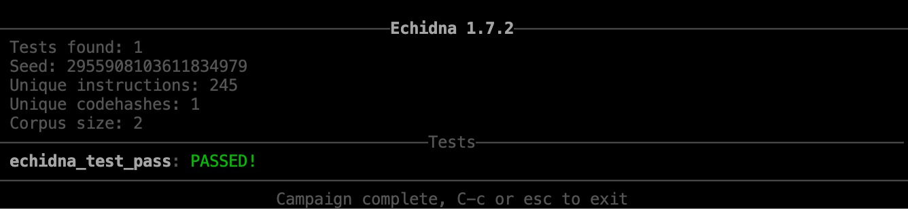

## 安装
- [源码](TestEchidna.sol)

- 在当前目录下运行下面命令
```
 docker run -it --rm -v $PWD:/code trailofbits/eth-security-toolbox
```

rm：在容器启动时设置--rm选项，这样在容器退出时就能够自动清理容器内部的文件系统


出现如下，安装成功
```


┌──        ┌──┐      ──┬──
├─         └──┐        │
└──THEREUM─┴──┴ECURITY─┴OOLBOX

https://github.com/trailofbits/eth-security-toolbox

by   ################
    ##########TRAIL#
         ####       
        ####    ###########
       ####    ###########
      \###    ####     ####
     /\\# of ####     ####
    /  \    ############ 
    \__/   ####      ####
          \###      ####
         /\\#########
        /__\\##BITS#

Security Tools and Resources Installed:

https://github.com/trailofbits/echidna
https://github.com/trailofbits/etheno
https://github.com/trailofbits/manticore
https://github.com/trailofbits/slither
https://github.com/trailofbits/rattle
https://github.com/trailofbits/not-so-smart-contracts

```

## 一些小测试

- 查看编译版本 

```
solc --version

solc, the solidity compiler commandline interface
Version: 0.8.9+commit.e5eed63a.Linux.g++

```


- 测试

```
ethsec@36ba204276db:/code$ echidna-test TestEchidna.sol --contract TestCounter
```

出现

```
ERROR:CryticCompile:Invalid solc compilation Error: Source file requires different compiler version (current compiler is 0.8.9+commit.e5eed63a.Linux.g++) - note that nightly builds are considered to be strictly less than the released version
```
原因：需要切换版本


再次进行测试



- 测试过程中，如果等待时间长，我们可以限制次数

```
ethsec@36ba204276db:/code$ echidna-test TestEchidna.sol --test-limit 500  --contract TestCounter
```            


- 如果我们想要测试失败结果,在合约内部加入如下逻辑，返回false即可

```
  function echidna_test_fails() public view returns(bool){
      return false;
   }
```


## 测试进阶

- 测试 

[源码](TestEchidna2.sol)


当执行第六次的时候，就出现failed.

- 切换solidity版本

```
ethsec@36ba204276db:/code$ solc-select install  0.7.6
Installing '0.7.6'...
Version '0.7.6' installed.
ethsec@36ba204276db:/code$ solc-select use 0.7.6
Switched global version to 0.7.6
ethsec@36ba204276db:/code$ solc --version
solc, the solidity compiler commandline interface
Version: 0.7.6+commit.7338295f.Linux.g++
```

- 测试 [assert](./TestEchidna3.sol) 

```
ethsec@36ba204276db:/code$ echidna-test TestEchidna4.sol   --contract TestAssert --check-asserts
```

当输入10的时候，会出现失败。


- 测试绝对数函数


[源码](TestEchidna4.sol)

```
ethsec@36ba204276db:/code$ echidna-test TestEchidna4.sol   --contract TestAssert --check-asserts

```


- 测试时间戳block.timestamp


[源码](TestEchidnaTestTimeAndCaller.sol)

```
ethsec@36ba204276db:/code$ echidna-test TestEchidnaTestTimeAndCaller.sol  --test-limit 5000 

```


当修改源码为 
```
   uint delay =70 days;
```


说明Echidna无法快进70天，因此没有修改pass的状态。

- 设置快进时间，time.yaml,可以快进70天

```
ethsec@36ba204276db:/code$ echidna-test TestEchidnaTestTimeAndCaller.sol  --test-limit 5000 --config time.yaml 
```


